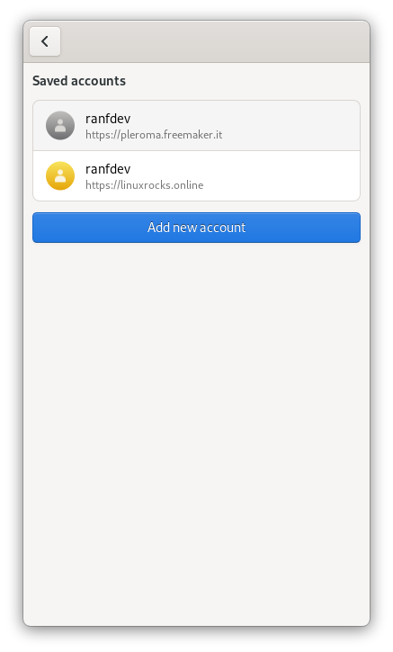
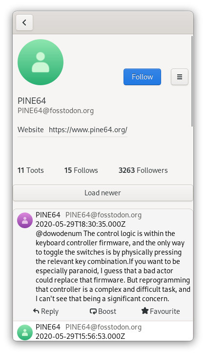
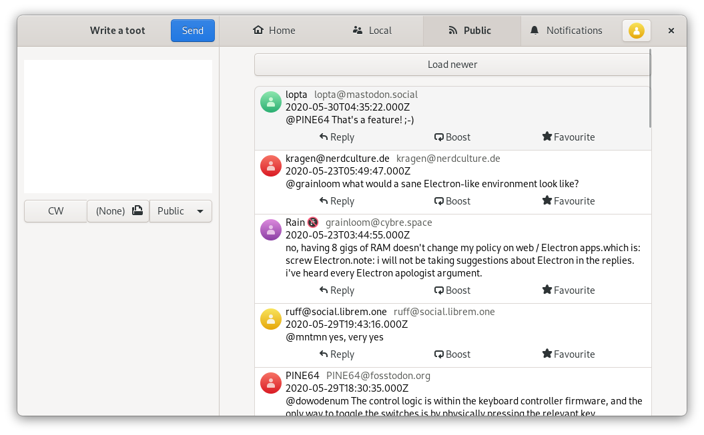
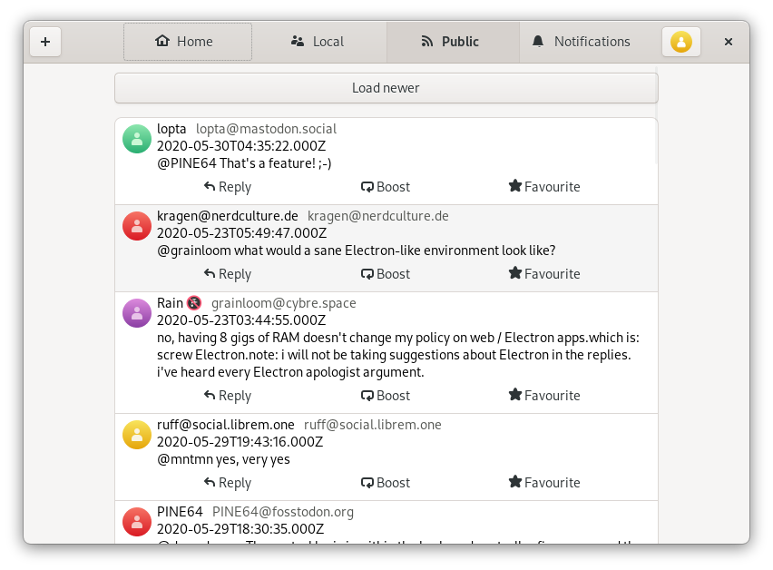
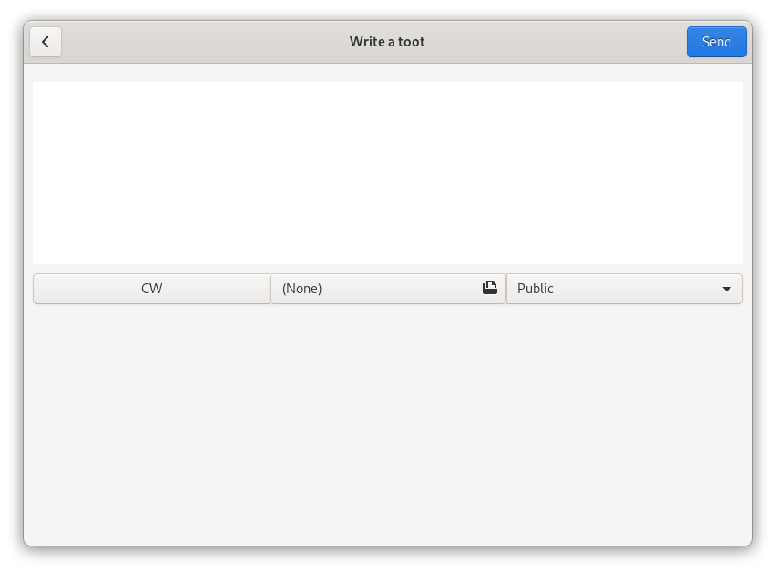

# Elefanto (alpha)

This is a [mastodon](https://joinmastodon.org/) and [pleroma](https://pleroma.social/)
compatible client, for GNU/Linux. It's written using Javascript, using the 
[gjs runtime](https://gitlab.gnome.org/GNOME/gjs) and using [gtk](https://www.gtk.org/).
By leveraging [libhandy](https://gitlab.gnome.org/GNOME/libhandy/), the interface will
adapt to different screen sizes, rendering it compatible with GNU/Linux smartphones. 

## Screenshots

## Features implemented
- Login with multiple accounts
- View the main timelines (home, local, public)
- Send a toot, with privacy settings (public, to followers only, etc...)
- View someone else's account page and toots
- Multiple 

# Compilation
This project uses meson and ninja as a build system.
It's also possible to compile it as a [flatpak](https://www.flatpak.org/),
rendering it compatbile with almost every GNU/Linux distro out there.
You can easily compile this by importing the project inside
[gnome builder](https://wiki.gnome.org/Apps/Builder) and hitting compile.

Better instructions for meson and ninja will come out as soon as i have
the time to release the first beta.
Since this is an alpha, things might change a lot.
